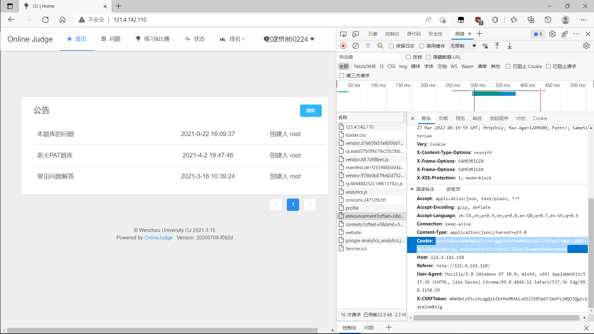

# OJ 实验报告生成

此程序用于 http://121.4.142.110/ Online Judge 温州大学 python 实验获取实验报告，若用于其他需要自行修改代码

### 使用方法

修改 user.json 中的姓名，学号，班级
修改有效的 cookie，用于服务器的登录验证

> cookie 获取
>
> - 登录 oj 网站
> - 右键检查或按 <kbd>F12</kbd>
> - 点击网络，刷新重新获取请求
> - 在请求里找到带 Cookie 的，复制下来
>   
